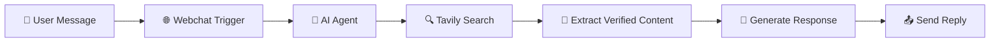
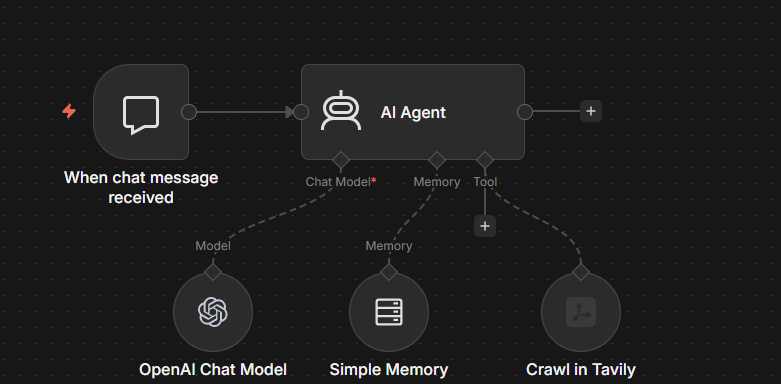

<h1 align="center">🤖 AI Webchat Assistant</h1>

  <b>Website-Verified AI • n8n • Smart Chat Automation</b> 
  Answer, search, and respond with real-time verified data — on autopilot.

  
  
  
  
  

---

## 🚀 Overview

Turn your website into a **smart AI assistant that delivers only verified answers**.

This system uses real-time search restricted to your domain, ensuring accurate, trustworthy responses — while eliminating hallucinations and external data risks.

---

## ✨ Why This Project?

* ❌ No fake or hallucinated answers
* 🔐 Strict domain-restricted responses
* ⚡ Real-time website data retrieval
* 🤖 Fully automated chat assistant
* 📈 Boosts trust and user engagement

---

## 🧠 How It Works

---

## 🖼️ Product Preview

  

  <b>End-to-end automation:</b> Ask → Search → Verify → Respond ⚡

